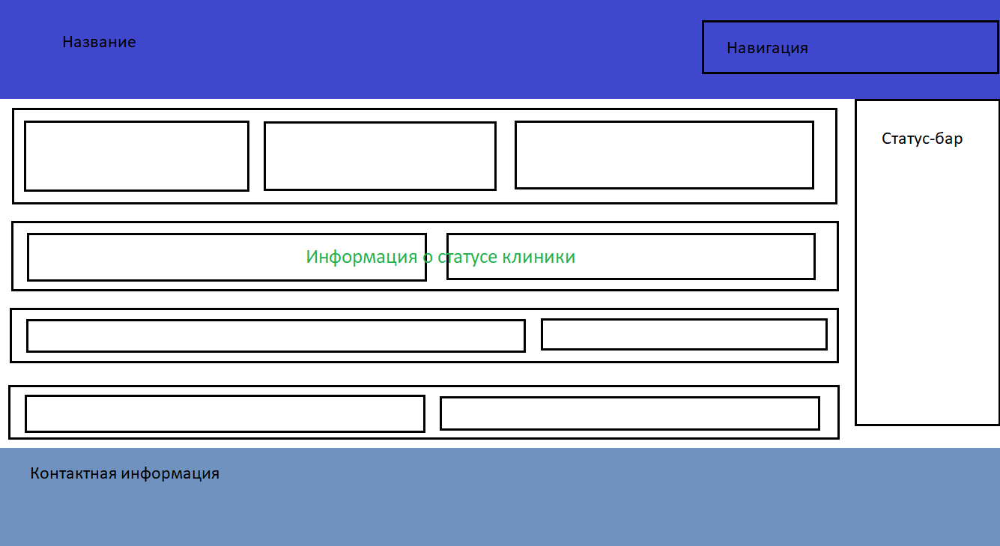

# M3301-Bigulov

## Информация о проекте
**ФИО:** Бигулов Александр Артурович  
**Группа:** M3301  
**Тема проекта:** Разработка сайта (CRM) для медицинского центра

## Описание
Проект представляет собой self-hosted CRM систему для медицинских клиник, созданную с использованием семантической HTML-разметки. Система предназначена для администрации клиники, регистратуры и врачей для управления пациентами, записями на прием, расписанием и отчетностью.

## Макет системы

Доступны следующие разделы:
- **Header** - навигационное меню с основными модулями системы
- **Main** - основное содержимое:
  - Dashboard - панель управления системой
  - Patients - управление пациентами и их данными
  - Doctors - управление штатом врачей
  - Schedule - планирование и календарь записей
  - Reports - отчеты и аналитика
  - Aside с уведомлениями системы
- **Footer** - системная информация и статус

## Функциональность CRM системы
Система включает следующие модули:
- **Управление пациентами** - регистрация, редактирование данных, история обращений
- **Управление врачами** - штат врачей, специализации, расписание
- **Планирование** - календарь записей, управление кабинетами
- **Отчетность** - статистика работы, аналитика, финансовые отчеты
- **Уведомления** - системные сообщения и напоминания

